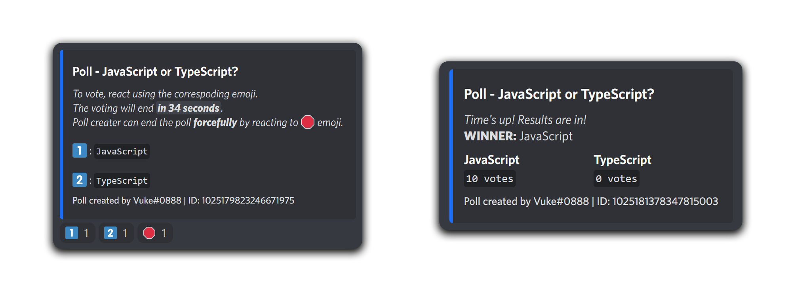

# discord-polls

discord-polls is a powerfull npm package that lets you make a quick poll message in a channel. Based on discord.js-poll-embed

<p align="center"><a href="https://nodei.co/npm/discord-polls/"></a></p>
<p align="center">    
  <a href="https://discord.gg/rk7cVyk"></a></p>



**DISCLAIMER:**

- Out of the box, this package will work discord.js v14. If you want the v13 version then check [Using discord.js v13]. (not currently available)

- discord-polls is a powerfull npm package that lets you make a quick poll message in a channel. Based on discord.js-poll-embed.
- If you need help feel free to join our <a href="https://discord.gg/hnzXhDh">discord server</a> to talk and get help.
- If you encounter any of issues fell free to open an issue in our <a href="https://github.com/Abdelrahman-Mohammad/discord-polls/issues">github repository</a>.

# 📁 | Download & Update

You can download it from npm:

```cli
npm install discord-polls
```

You can update to a newer version to receive updates using npm.

```cli
npm update discord-polls
```

# Changelog

- **30 Sept, 2022** (v1.0.0) - Added startPoll method.

# Setting Up

First things first, we include the module into the project.

```js
const Polls = require("discord-polls");
```

Then, we call the methods for creating the polls.

```js
Polls.startPoll(...);
```

# 📝 | Examples

_Examples can be found in [/test](https://github.com/Abdelrahman-Mohammad/discord-polls/tree/main/test#discord-polls)_

# Methods

### **startPoll**

Starts a new poll.

```js
Polls.startPoll(<Interaction - Discord.Interaction>, <ForumHeader - String | "New Forum">, <ForumTitleLabel - String | "Title">, <ForumDescriptionLabel - String | "Description">);
```

- Output:

```
Promise<Object>
```

Have fun and happy discussions! Made with ❤ by Abdelrahman.
